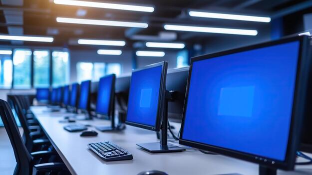

# Introduction to Computers

## Project Description

## Computer Image



This project provides an introduction to computers, their basic concepts, different types, and the history of computer development.

## Introduction to Computers

A computer is an electronic device that accepts data, processes it according to instructions, produces information, and stores results.

Computers are **important** in modern life because they are used in education, business, communication, science, healthcare, and many other fields.

Computers can perform tasks *quickly and accurately*.


## Types of Computers

Computers are available in different types depending on their size, processing power, and purpose.

### Supercomputers

Supercomputers are very powerful computers used for complex calculations and scientific research.

### Mainframe Computers

Mainframe computers can process large amounts of data and support many users at the same time.

### Personal Computers

Personal computers are designed for individual users. Desktop computers and laptops are common examples.

### Servers

Servers provide data, services, or resources to other computers through a network.

### Embedded Computers

Embedded computers are built into other devices and perform specific tasks.

## Types at a Glance

| Type | Main Purpose |
|---|---|
| Supercomputer | Complex calculations |
| Mainframe | Large-scale data processing |
| Personal Computer | Individual use |
| Server | Network services |
| Embedded Computer | Specific functions |


## History of Computers

The history of computers shows how computing devices developed from simple calculating tools into powerful modern machines.

### Early Computing Devices

The abacus was one of the earliest tools used to perform calculations. It helped people carry out arithmetic operations.

### Mechanical Computers

Charles Babbage designed the Analytical Engine, which introduced important ideas similar to those used in modern computers.

### First Generation

First-generation computers used vacuum tubes. They were very large, expensive, and consumed a lot of electricity.

### Second Generation

Second-generation computers used transistors instead of vacuum tubes. This made computers smaller, faster, and more reliable.

### Third Generation

Third-generation computers used integrated circuits, which allowed more components to fit into smaller spaces.

### Fourth Generation

Fourth-generation computers introduced microprocessors and led to the development of personal computers.

### Modern Computers

Modern computers are much smaller and more powerful. Technologies such as artificial intelligence, cloud computing, smartphones, and high-performance computing are now widely used.

## Tools Used

- GitHub
- Git
- Markdown
- Web browser

- ## Project Workflow

1. Create the GitHub repository.
2. Create a separate branch.
3. Create and update the README.md file.
4. Make meaningful commits.
5. Push changes to GitHub.
6. Create a Pull Request.
7. Review the changes.
8. Merge the Pull Request into the main branch.

9. ## Basic Computer Process

```text
Input → Processing → Output → Storage


```markdown
## Project Checklist

- [x] Create GitHub repository
- [x] Create student branch
- [x] Add introduction
- [x] Add types of computers
- [x] Add history of computers
- [x] Create three meaningful commits
- [ ] Create Pull Request
- [ ] Review changes
- [ ] Merge Pull Request

## Useful Link

[Visit GitHub](https://github.com/)

## Student Information

- **Name:** Muhammad Taha Memon
- **Roll Number:** 26K-3114
- **Course:** Introduction to Computers
- **Repository:** Introduction-to-Computers
